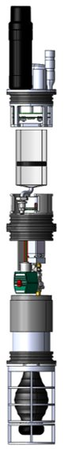

# RoboSharks - MicroFloats

Welcome to the Team RoboSharks MicroFloats Github page. I hope you enjoy your stay!

MicroFloats is a project that aims to develop a swarm of autonomous underwater vehicles for ocean exploration. The current mission it is being developed for is the discovery of larval dispersion. Scientists in Stellwagen Bank, MA are researching this unknown phenomena, and the MicroFloats will greatly aid this scientific discovery effort.

MicroFloats is an ongoing project at Georgia Tech and has had several iterations of Senior Design teams and VIP teams working on it, hence the somewhat disorganized and multilayered structure. The VIP team has a helpful wiki that helps to explain some of the electronics and BMS specifics (link [here](https://github.gatech.edu/mwoodward6/LagrangianProfiler/wiki)!)

Check out our [website](https://eceseniordesign2022spring.ece.gatech.edu/sd22p17/) for more documentation and information about the project! The details of the github are explained below.

## CAD Models

This folder contains all of the CAD models in .SLDPRT format, and were created in SolidWorks. Details on measurements can be found in the fabrication package on our website.

## MatLab Simulations

This folder contains MatLab simulations done for the Power subsystem and antenna range. These give rough metrics for how the MicrFloat will perform since we were not able to test it in full operation.

## PCB

The PCB folder contains three subfolders, one for the Battery Management System (BMS), one for the Sensor Board, and one for the Contorl Board. These all have the most up to date KiCAD PCB schematics and board layouts in there. They also include the latest Gerber and Drill files for assembly, but it is RECOMMENDED to run a DRC again before using these pregenerated files...maybe we missed something!

## Test Code

This folder contains all the code needed to test the MicroFloat and the Sensor board in particular. 

### MicroFloat Test Code

The Arduino test Code for the whole MicroFloat came mostly from the previous team (RUR) and was adapted for our needs. Note: these files are for use with the current electronics prototyping setup, which uses an SAMD51 Thing Plus. You will have to configure your Arduino IDE to interface with this board correctly as described [here.](https://learn.sparkfun.com/tutorials/samd51-thing-plus-hookup-guide/uf2-bootloader--drivers)

The following is the documentation on each of the methods for the MicroFloats test code, taken from RUR's documentation.

The following is a brief overview and description of each test code found in the MicroFloat-Test repository. Most of the code listed is for priming the system and making sure that enough oil is in the bellows versus the reservoir to achieve neutral buoyancy. When using the following programs to calibrate oil levels, it is recommended that the electronics are off to the side so that the cap of the reservoir can be taken off, and the oil levels can be monitored. Watching the oil levels is crucial as contracting or expanding the bellows too much could cause it to pop, and expanding the bellows beyond the amount of oil in the reservoir introduces air to the system. 

*do_nothing*
This program will do as it is called, nothing. This program was written in order to test the float underwater to check neutral buoyancy. It is necessary simply because the power switch at the top of the float needs to be screwed in (and therefore the system is powered). This program ensures that the microcontroller does not send any commands. 

*full_contract*
This program will remove all oil from the bellows and into the reservoir. This would be used if trying to readjust the timings if the oil levels in the reservoir/bellows became inconsistent. This program will run once.

*full_expand*
This program will remove all the oil from the reservoir and into the bellows. This would also be used to readjust the timings if the oil levels in the reservoir/bellows became inconsistent. This program will run once.

*half_contract*
This code will remove half of the oil from the bellows, into the reservoir. This code would be run if the bellows was fully expanded with oil, and the desired state was only half expanded with oil. In this case, the float would then be at neutral buoyancy. This program will run once.

*half_expand*
This code will add half the oil from the reservoir into the bellows. This could be run if the bellows was fully contracted and the desired state was half expanded with oil. In this case, the float would then be at neutral buoyancy. This program will run once. 

*mission*
This is code to be run in a test environment. The code assumes that the starting state is with a  half contract/half expanded bellows (neutral buoyancy). It will then sink the bottom of a pool by half contracting the bellows (resulting in no oil in the bellows). It will then expand half way and wait at the bottom of the pool. The float will then expand the bellows the rest of the way to rise, and then half contract the bellows to reach neutral buoyancy again. This program runs in a loop.

### Sensor Board Test Code

The Sensor Board testing setup is described in the Final Report. Basically, it uses an ARM mbed microcontroller (hence the mbed C++ code) to send RS-232 signals to the Sensor Board, and then reads the I2C output from the Sensor Board using an Arduino. The mbed code needs to be flashed onto the mbed, and then the computer needs to be connected to the Arduino so that the serial monitor can be read to see the I2C addresses and data. The **I2C Demo** code finds the I2C addresses that are currently responding. The other programs can be used to try to get data from the Sensor Board.

## VIP Team Files

This folder contains all the VIP files at the time of our project. This could be used, but it would be better to check on the latest status on the [VIP's actual Github page](https://github.gatech.edu/Aquabots-VIP), where they have links to various useful repositories.

Have fun!

